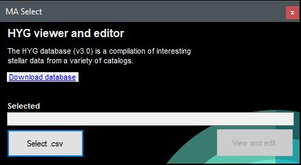
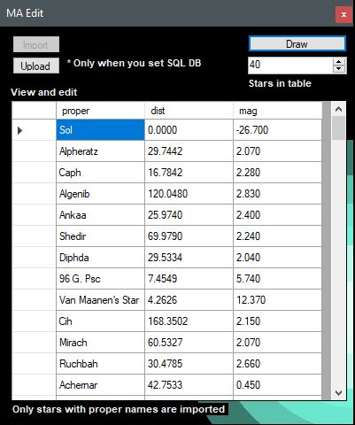
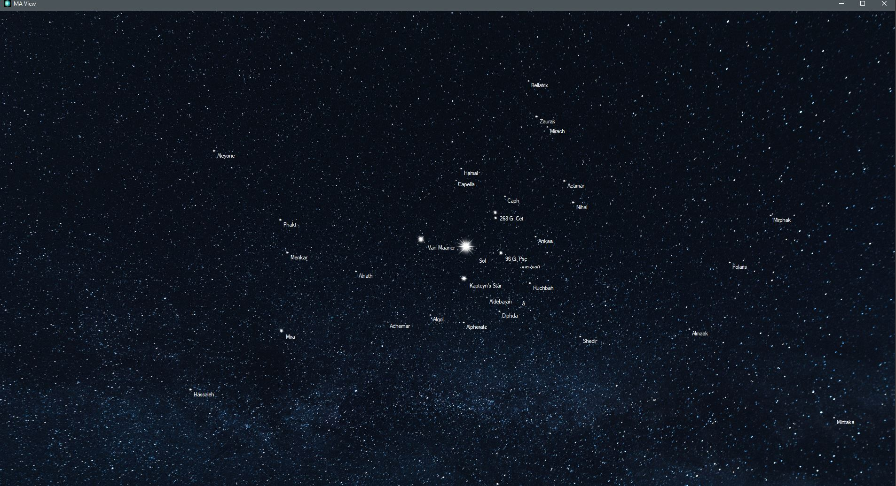

# HYGviewer
Windows form application built to visualize the HYG star database based on [astronexus/HYG-Database](https://github.com/astronexus/HYG-Database).
## Features
This application has the following features:
* Import of .csv HYG database
* Upload to local SQL server
* View, edit and update the data
* Visualisation of the imported data (stars)

## Import
The HYG star database contains several different values assigned to all of the stars (positio, name, brightness, distance from the sun, etc..). Out of that data, only the name of stars, their distance from the sun and their brightness are shown in the table. You are free to edit the data and upload to your local database.

## Visualisation
The visualization window/form is a Full HD interactive window used to visualize the star's distance from the sun and its brightness.

Star properties
* Brightness (mag)
* Names (proper)
* distance (dist)

**As I am not importing the X and Y position of the stars in universe they are drawn with the sun in the center and their distance from the sun. Important - The distance from the sun is true for the scale but the position is randomized.**
```
Note that this application is built for an educational purpose.
```


## Application screenshots





## License
This project is licensed under the MIT License - see the [LICENSE.md](LICENSE) file for details
